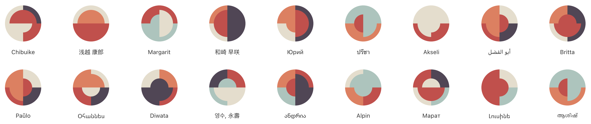

<a href="https://www.npmjs.com/package/boring-avatars" target="_blank">


</a>

# Boring Avatars

## Install

```jsx
import Avatar from "boring-avatars";
```

## Usage

```jsx
<div>
  <Avatar size="64px" variant="abstract" name="Mike" />
</div>
```

### Props

| Prop    | Type                           |
| ------- | ------------------------------ |
| size    | number or string               |
| name    | string                         |
| variant | oneOf: "abstract", "geometric" |

---

**Built with**
[Create React Library](https://github.com/DimiMikadze/create-react-library)
